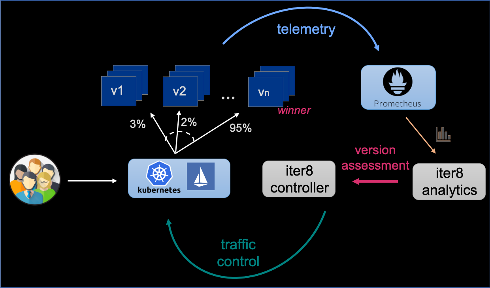

# iter8

> Welcome to the iter8 domain package for Istio. This package enables metrics-driven experiments, progressive delivery, and automated rollouts for Istio applications.

The picture below illustrates a metrics-driven A/B/n rollout experiment of deployments orchestrated by iter8 over Istio.

## Table of Contents

- [Concepts](#concepts)
- Installation
  - [On Kubernetes](docs/installation/kubernetes.md)
  - [On OpenShift](docs/installation/openshift.md)
- Tutorials
  - [Canary experiment](docs/tutorials/canary.md)
  - [Canary experiment on OpenShift](docs/tutorials/canary-openshift.md)
  - [A/B/n rollout experiment](docs/tutorials/abn.md)
  - [A/B/n rollout experiment on OpenShift](docs/tutorials/abn-openshift.md)
  - [Performance validation](docs/tutorials/performance.md)
- Tasks
  - [Request header matching](docs/tasks/header-match.md)
  - [Prometheus configuration](docs/tasks/prometheus-config.md)
  - [Reusing VirtualServices](docs/tasks/vs-reuse.md)
- Integrations
  - [Kiali](docs/integrations/kiali.md)
  - [Kui](docs/integrations/kui.md)
  - [Trend](docs/integrations/trend.md)
  - [Grafana](docs/integrations/grafana.md)
- Reference
  - [Experiment CRD](docs/reference/experiment.md)
  - [Metric CRD](docs/reference/metrics.md)
  - [Algorithms](docs/reference/algorithms.md)

For information on using iter8 for Kubernetes and OpenShift application stacks beyond Istio, visit [iter8.tools](https://iter8.tools).

## Concepts

### What is iter8?

You are developing a distributed microservices-based application on Kubernetes and have created alternative versions of a service. You want to identify the `best` version of your service using a live experiment and rollout this version in a safe and reliable manner.

Enter `iter8`.

Iter8 is an open source toolkit for `continuous experimentation` on Kubernetes. Iter8 enables you to deliver high-impact code changes within your microservices applications in an agile manner while eliminating the risk. Using iter8's machine learning (ML)-driven experimentation capabilities, you can safely and rapidly orchestrate various types of live experiments, gain key insights into the behavior of your microservices, and rollout the best versions of your microservices in an automated, principled, and statistically robust manner.

### What is an iter8 experiment?

Use an `iter8 experiment` to safely expose alternative versions of a service to application traffic and intelligently rollout the best version of your service. Iter8's expressive model of experimentation supports a diverse variety of experiments. The four main kinds of experiments in iter8 are as follows.

1. Perform a **canary release** with two versions, a baseline and a candidate. Iter8 will shift application traffic in a safe and progressive manner to the candidate, if the candidate meets the criteria you specify in the experiment.
2. Perform an **A/B/n rollout** with multiple versions -- a baseline and multiple candidates. Iter8 will identify and shift application traffic safely and gradually to the `winner`, where the winning version is defined by the criteria you specify in your experiments.
3. Perform an **A/B rollout** -- this is a special case of the A/B/n rollout described above with a baseline and a single candidate.
4. Run a **performance test** with a single version of a microservice. `iter8` will verify if the version meets the criteria you specify in the experiment.

### How does iter8 work?

Iter8 is composed of a Kubernetes controller and an analytics service which are jointly responsible for orchestrating an experiment, and making iterative decisions about how to shift application traffic, how to identify a winner, and when to terminate the experiment. Under the hood, iter8 uses advanced Bayesian learning techniques coupled with multi-armed bandit approaches for statistical assessments and decision making."
